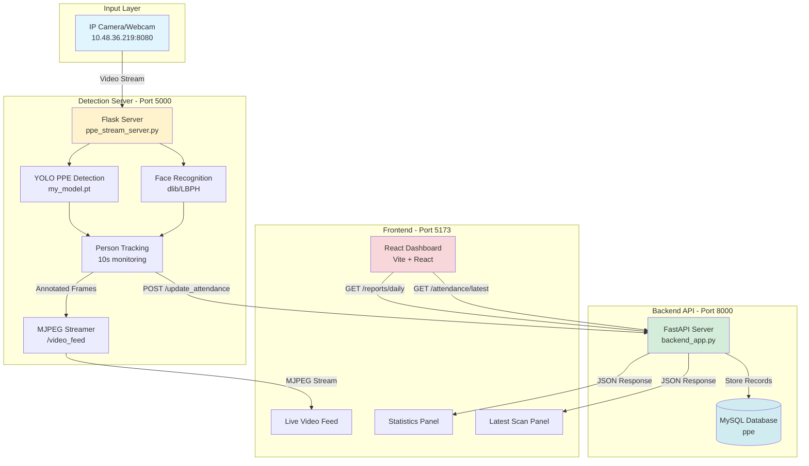
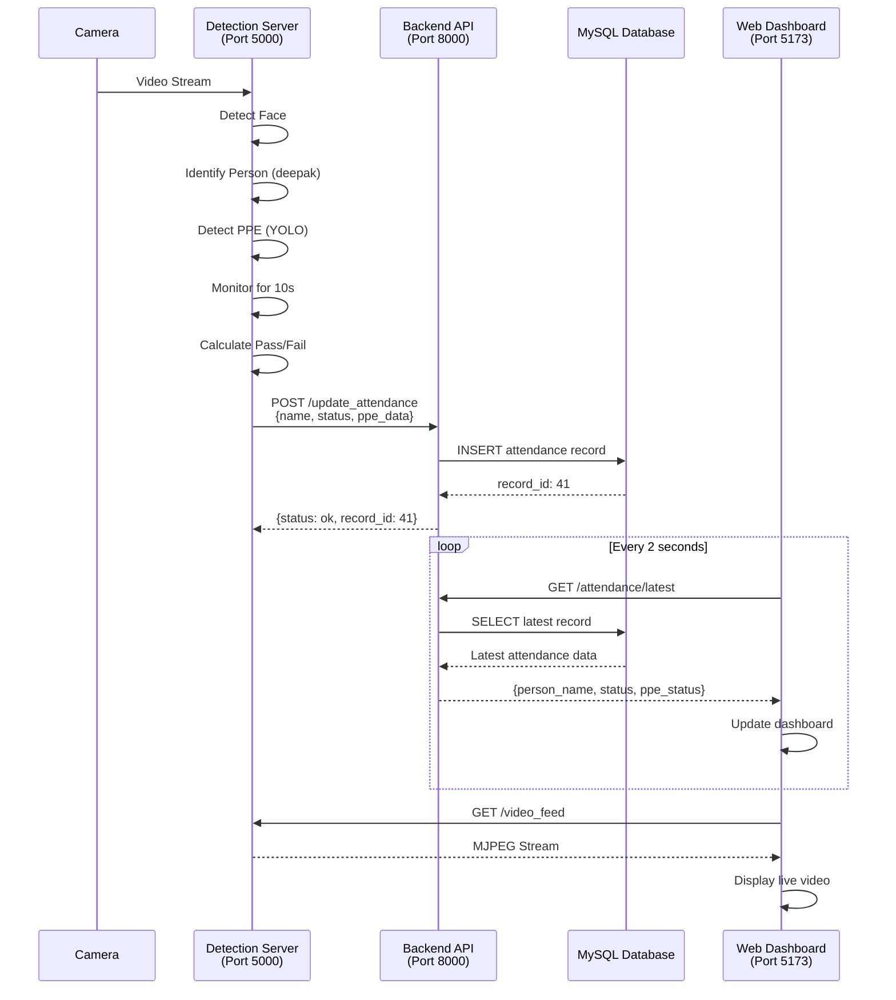
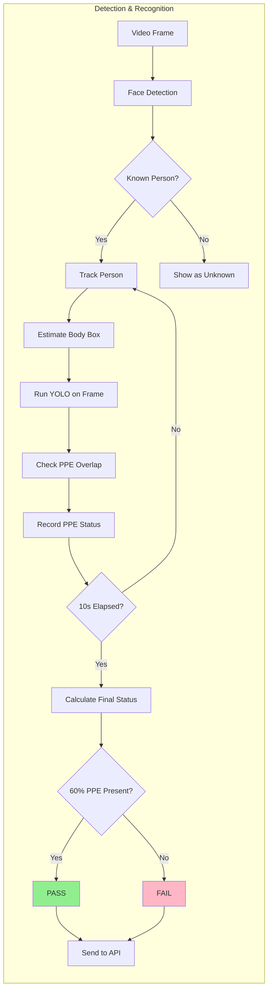
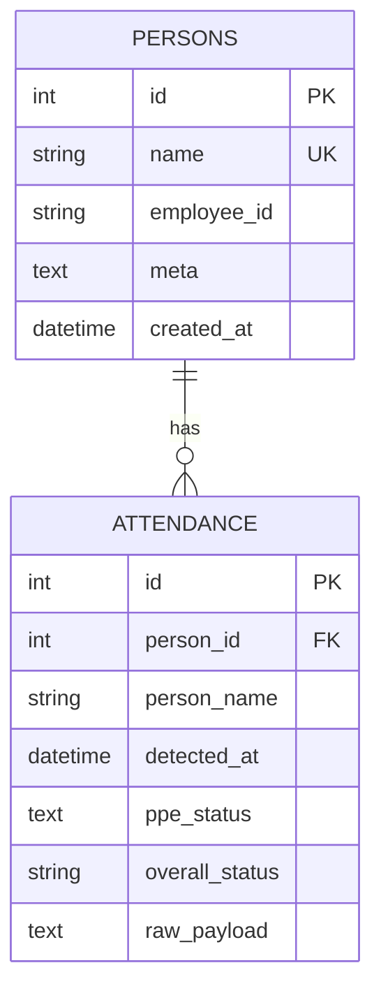
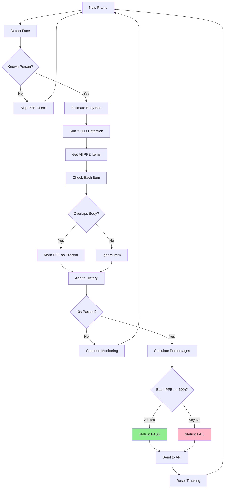

# System Architecture Diagram

## Complete System Flow



## Data Flow Sequence



## Component Interaction Map



## Database Schema



## PPE Detection Logic



## System Ports & Services

| Service | Port | Technology | Purpose |
|---------|------|------------|---------|
| Detection Server | 5000 | Flask | Video streaming & PPE detection |
| Backend API | 8000 | FastAPI | Data management & REST API |
| Frontend | 5173 | Vite/React | Web dashboard UI |
| Database | 3306 | MySQL | Data persistence |

## File Structure

```
d:\SIH1\
├── backend_app.py              # FastAPI backend server
├── ppe_stream_server.py        # Flask streaming + detection
├── ppe_attendance_combined_optionB_fullframe.py  # Standalone detection
├── requirements.txt            # Python dependencies
├── PROJECT_OVERVIEW.md         # This documentation
├── README.md                   # Project readme
│
├── frontend\                   # React frontend
│   ├── src\
│   │   ├── pages\
│   │   │   └── Dashboard.jsx   # Main dashboard component
│   │   └── api\
│   │       └── client.js       # API client
│   └── package.json
│
└── D:\sf\my_model\            # Model & training data
    ├── my_model.pt            # YOLO PPE detection model
    └── known_faces\           # Face recognition dataset
        ├── deepak\
        ├── augustin\
        └── ...
```
